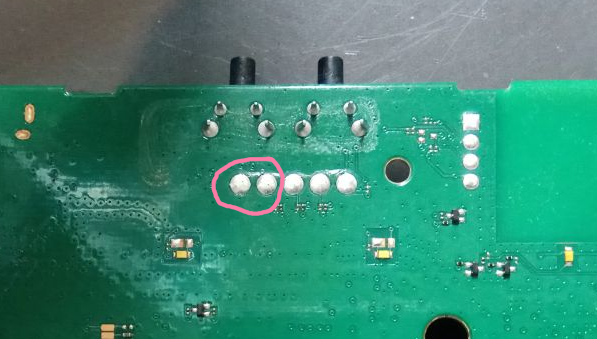

# B525s-23a

## Entering DFU and communicating with it

Opening your router is easy, but there's a trick with some models, like those from T-Mobile PL. They hide the USB port behind plastic, so you'll need to unscrew the board to get to it. If you want easier access later, you can use a knife to rip out a hole for the USB.

To communicate with the DFU/BootROM/whatever this thing is, you will need an USB-A <> USB-A cable or if you have a PC with USB-C, then USB-C <> USB-A will work too :)

To enter DFU, you will need to short 2 pins (shown below) on the board.



## Flashing fw

If you use [Nix/NixOS](https://nixos.org/) you can just run `nix develop` in root of this repo and easily get an environment with all tools needed for this.

For `balong-usbdload` you'll use `/dev/ttyUSB0`, after sending usbloader `/dev/ttyUSB1` should appear to be used with `balong_flash`

To access these devices you'll need to add your user to `dialout` group or run tools as root.

```
balong-usbdload -p /dev/ttyUSB0 usbdload/usblsafe_b525.bin
balong_flash -p /dev/ttyUSB1 <whatever fw you want can be .exe or .bin, balong_flash will parse it properly>
```

If you're flashing stock firmware - that's all! Just reboot and factory reset from WebUI at `192.168.8.1` just to be sure.

If you flashed modded firmware - reboot, connect to WebUI at `192.168.8.1`, go to updates section and locally flash `mod2.1/webui/WEBUI_B525s_81.100.33.03.03_Mod2.1.ZIP.bin`. Once it finishes ofc do a factory reset.

## First boot

**On both of these firmwares the correct initial admin password is just `admin`.**

In setup wizard turn off autoupdate or Huawei might epicly troll you in the future.

### Securing telnet/root access.

Now the funny part is here - both of these firmwares (yes including the stock one!!!!!!!!!!!!) have telnet with root access open on port 23. It is however possible to set a password for it and that's what you should do.

I have no idea what's happening here, it's also quite funny, these routers are literally running Android 4.4.1 with test-keys.

okay, so what u need to do is to connect to the shell with `nc 192.168.8.1 23`

and run these thingies, basically /system is read only like on andrut so u have to remount it first :OO

```
mount -o remount /system
passwd
sync
```

There's also `adbd` server running, setting up a password for root turns it off.

Once you `sync` do a reboot from the WebUI, for some reason running `reboot` in shell like a normal person would do might result in all ur settings to be lost.

If you try to connect to shell again, it'll ask u for the password.

#### Removing root password

```
mount -o remount /system
passwd -d root
sync
```

and ofc reboot from WebUI.

## Fixing NVRAM

Now, if you fricked something up, or you used some weird firmware, ur nvram might have gotten broken. The most obvious symptom of that is that all ur settings are lost after every reboot/powercycle.

To fix it up, check out `nvram-fix.sh` in this repo.

There's a chance that fixing your NVRAM might result in ur device losing factory data like it's own MAC or default passwords. You can set them up again (from the sticker) with AT commands explained below.

## AT commands

Once you connect to telnet shell, you should have `atc` tool available. It allows you to run AT commands.

- `AT^SN?` - Show device serial number.
- `AT^SN=0123456789ABCDEF` - Set device serial number.
- `AT^PHYNUM?` - Show device IMEI and MAC address.
- `AT^PHYNUM=IMEI,000000000000000,0` - Set device IMEI.
- `ATI` - Check device manufacturer, model, revision, and IMEI.
- `AT^PHYNUM=MAC,000000000000,0` - Set device MAC address.
- `AT^MAXLCKTMS?` - Show unlock code attempt.
- `AT^MAXLCKTMS=10` - Set or reset unlock code attempt to 10.
- `AT^SIMLOCK?` - Show SIM lock network code.
- `AT^SIMLOCK=1,2,51502,51502` - Set SIM lock to God knows why, I found this on pastebin LOL
- `AT^NVWREX=8268,0,12,1,0,0,0,2,0,0,0,A,0,0,0` - Remove SIM lock.
- `AT^SSID=0,"B315_00000"` - Set device WLAN SSID 1.
- `AT^SSID=1,"B315_00000-1"` - Set device WLAN SSID 2.
- `AT^SSID=2,"B315_00000-2"` - Set device WLAN SSID 3.
- `AT^SSID=3,"B315_00000-3"` - Set device WLAN SSID 4.
- `AT^SSID?` - Show all WLAN SSIDs.
- `AT^WIKEY=0,"00000000000"` - Set device WLAN password 1.
- `AT^WIKEY=1,"00000000000"` - Set device WLAN password 2.
- `AT^WIKEY=2,"00000000000"` - Set device WLAN password 3.
- `AT^WIKEY=3,"00000000000"` - Set device WLAN password 4.
- `AT^WIKEY?` - Show all WLAN passwords.
- `AT^INFORBU` - Write all values in default/reset/NVRAM. [Note: When you reset your modem, the values you set will appear as the default configuration.]
- `AT^RESET` - Reboot or restart the device.

As an example, to change your IMEI:

```
atc AT^PHYNUM=IMEI,866461290792909
atc AT^INFORBU
atc AT^RESET
```
